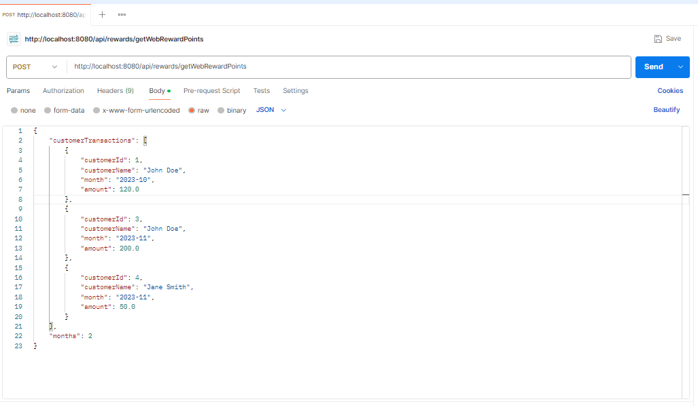
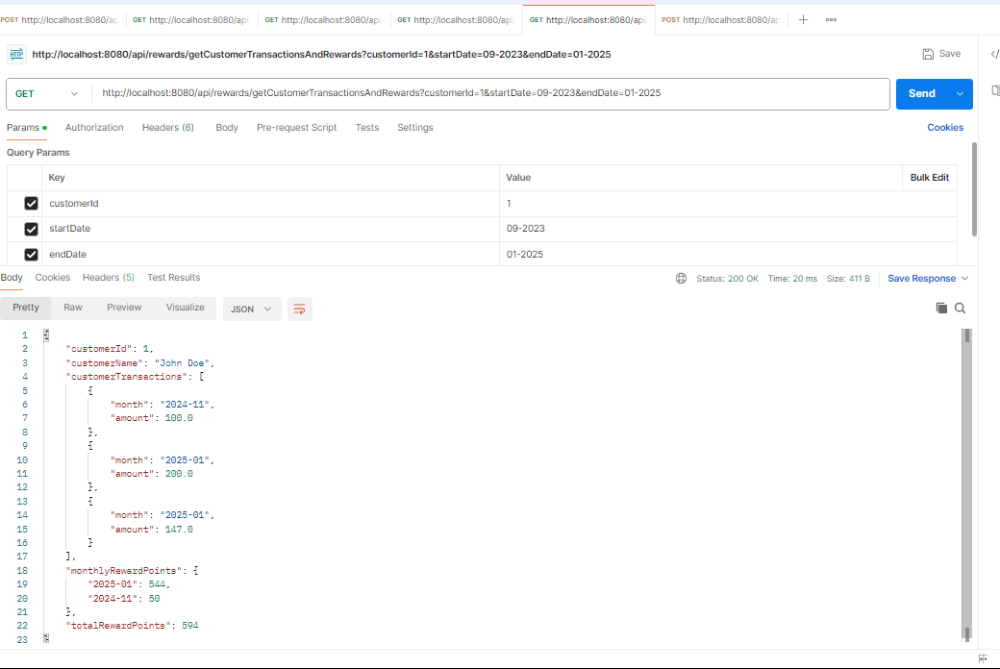

# Rewards Program API

## Problem Description
1. A retailer offers a rewards program to its customers, awarding points based on each recorded purchase. The points are calculated as follows:
- **2 points** for every dollar spent over $100 in each transaction.
- **1 point** for every dollar spent between $50 and $100 in each transaction.

For example:
- A purchase of $120 earns `2x$20 + 1x$50 = 90 points`.

2. Create GET endpoint for fetching customer information along with rewards.

---

## API Endpoint
1. **getWebRewardPoints**: Returns ResponseEntity containing the calculated rewards or an error message in case of failure.  
**URL**: `/api/rewards/getWebRewardPoints`
2. **getCustomerTransactionsAndRewards**: Returns ResponseEntity containing the calculated rewards, customer data for the specific customer ID.  
**URL**: `/api/rewards/getCustomerTransactionsAndRewards?customerId=1&startDate=09-2023&endDate=01-2025`
---
## **Screenshot**





## Sample Input for getWebRewardPoints
```json
{
  "customerTransactions": [
    { "customerId": 1, "customerName": "John Doe", "month": "2023-10", "amount": 120.0 },
    { "customerId": 2, "customerName": "Jane Smith", "month": "2023-10", "amount": 75.0 },
    { "customerId": 3, "customerName": "John Doe", "month": "2023-11", "amount": 200.0 },
    { "customerId": 4, "customerName": "Jane Smith", "month": "2023-11", "amount": 50.0 },
    { "customerId": 5, "customerName": "John Doeee", "month": "2025-01", "amount": 130.0 },
    { "customerId": 6, "customerName": "Jane Smith", "month": "2024-12", "amount": 90.0 },
    { "customerId": 5, "customerName": "John Doeee", "month": "2024-12", "amount": 140.0 }
  ],
  "months": 2
}
